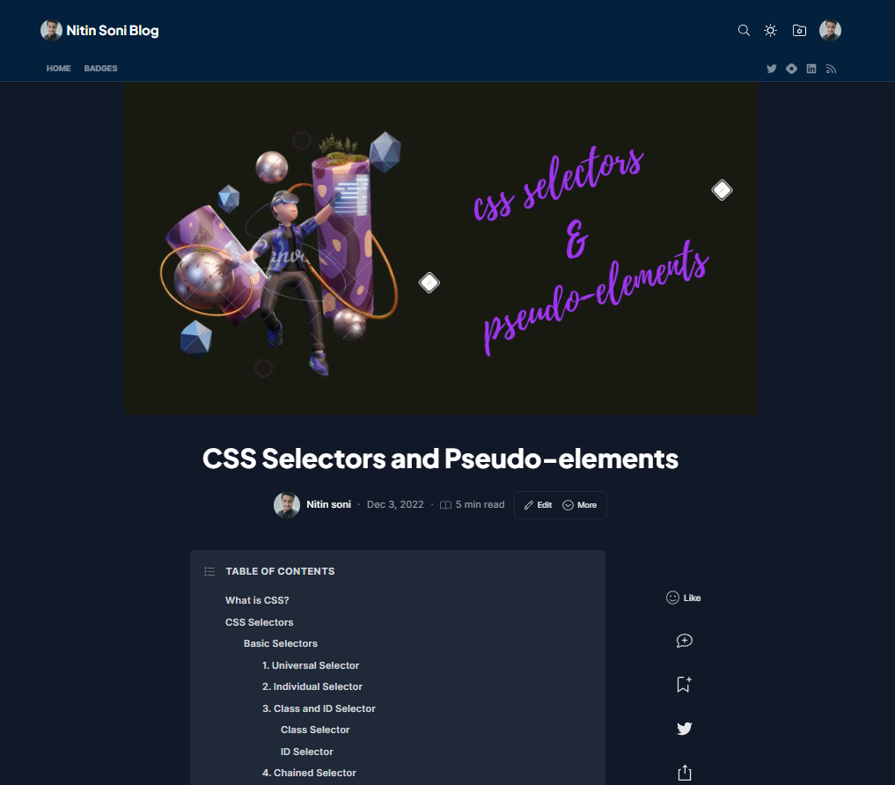

# Full Stack Javascript 2.0

## HTML and CSS Articles

**Article 1**  

[Link to open Article 1](https://nitinsoni90.hashnode.dev/web-server)

 
.  

.  

**Article 2**

[Link to open Article 2](https://nitinsoni90.hashnode.dev/html-elements)

 
.  

.  
**Article 3**  

[Link to open Article 3](https://nitinsoni90.hashnode.dev/all-about-input-element)

 
.  

.  
**Article 4**  

[Link to open Article 4](https://nitinsoni90.hashnode.dev/audio-and-video-tags)

 
.  

.  
**Article 5**  

[Link to open Article 5](https://nitinsoni90.hashnode.dev/css-selectors-and-pseudo-elements)

 
.  

.  
**Article 6**  

[Link to open Article 6](https://nitinsoni90.hashnode.dev/css-flexbox)

 
.  

.  
**Article 7**  

[Link to open Article 7](https://nitinsoni90.hashnode.dev/positioning-elements-in-css)

 
.  

.  
**Article 8**  

[Link to open Article 8](https://nitinsoni90.hashnode.dev/css-box-model)

 
.  

.  
**Article 9**  

[Link to open Article 9](https://nitinsoni90.hashnode.dev/css-media-query)

 
.  

.  
**Article 10**  

[Link to open Article 10](https://nitinsoni90.hashnode.dev/css-grid-layout)

 